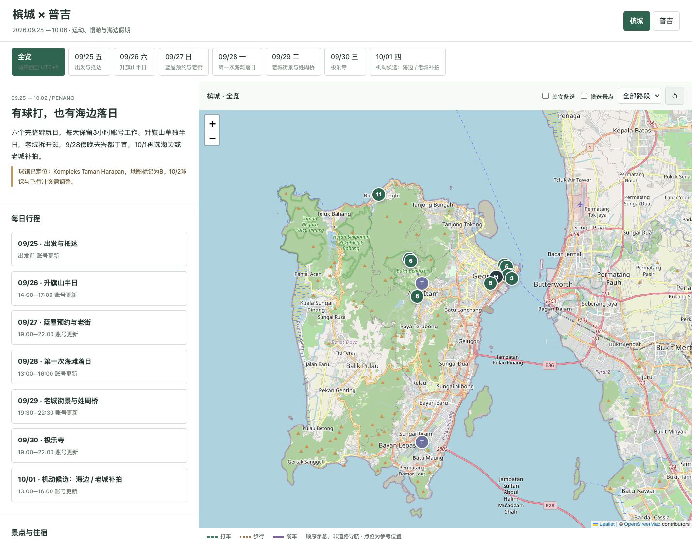
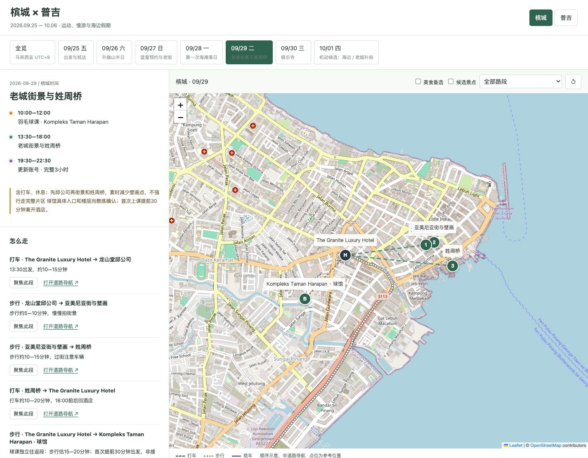
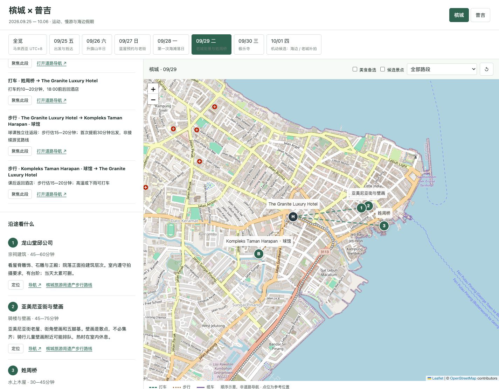
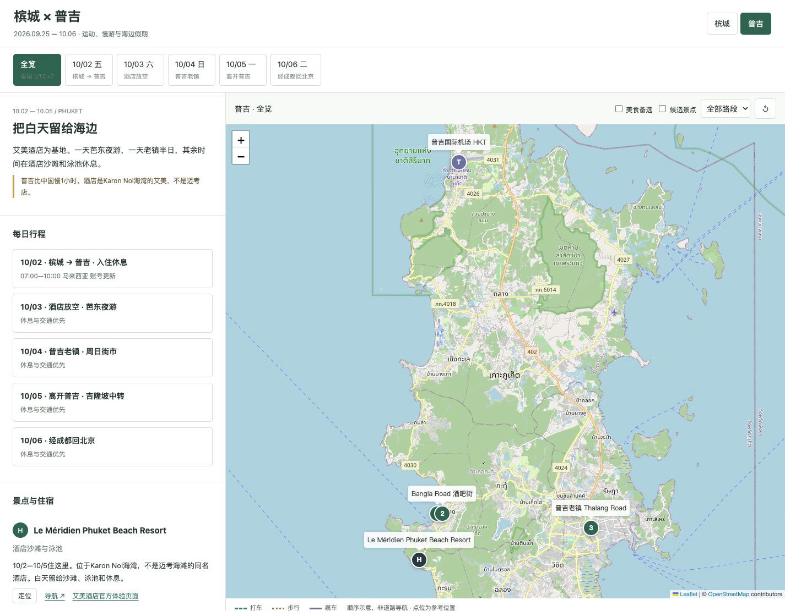
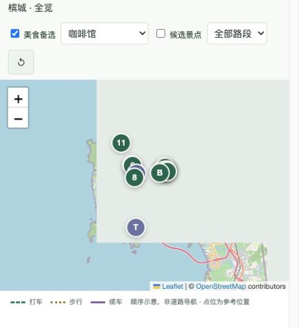
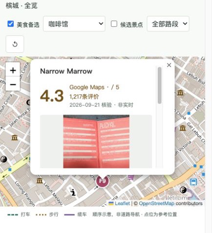

# 旅行攻略与交互地图

[English documentation](README.en.md)

只给一个目的地也能开始。支持文字描述、截图或文件，兼容日期未定、单程或往返机票、有无酒店；逐步完成景点认识、方案比较、交通与拍照路线、美食筛选、交互地图和按需发布。

## 实际 Demo

以下为现有槟城与普吉攻略的完整桌面截图，展示日期切换、城市切换、景点、交通和说明区域；示例安排不是适用于所有人的固定模板。截图中的评分为当时核验快照，不代表当前实时数据。现有 Demo 为中文；中英文切换是新版 Skill 的输出要求，尚未在此 Demo 实现，不能把截图当作双语功能验证。

### 1. 多日行程与景点全览

顶部切换日期与城市，左侧查看多日安排，右侧对应整座城市的景点和交通点。

### 2. 当天怎么走

单日时间安排、步行和打车耗时、逐段导航与地图路线同屏查看。虚线表示游览顺序，并非真实道路轨迹。

### 3. 沿途看什么

下滑左侧阅读景点特色、建议停留时间和游览提醒，地图继续保留当天点位。

### 4. 切换到另一座城市

选择普吉后，日期、行程与地图一起切换；多城市旅行不必拆成互不关联的攻略。

### 5. 美食细节

| 按品类筛选地图 | 评分、实拍与滚动详情 |
| --- | --- |
|  |  |

美食默认隐藏，勾选后显示；选择咖啡馆、甜品或夜宵等类别可过滤美食标记。点开标记查看评分、评价数、核验日期和实拍图片，浮窗内可继续滚动到介绍与导航。其他景点图层仍可保留作位置参照。

底图 © OpenStreetMap contributors，地图组件 Leaflet；截图内商家照片来源于 Google Maps 商家页，版权归原作者。这里展示的是生成结果的界面，不附带个人行程 HTML 或托管中的在线 Demo。

## 能帮你做什么

| 阶段 | 你可以提供 | Skill 应交付 |
| --- | --- | --- |
| 从零开始 | 只有目的地，或大概天数与兴趣 | 片区认识、代表景点、推荐天数、不同强度的方案 |
| 已有安排 | 文字或截图；单程、往返机票；部分或完整酒店 | 已知事实与待定项、固定预约、首尾日与时区约束 |
| 景点与拍照 | 想看什么、怕热、体力或拍照偏好 | 顺路搭配、停留建议、机位、交通段和降级方案 |
| 美食选择 | 想吃的品类，或可读取的收藏 | 分类候选、评分来源、推荐菜、优先级和顺路搭配 |
| 生成地图 | 选定方案，或明确要求先做草案 | 全览、单日、分段、点位弹窗、候选图层、外部导航 |
| 持续调整 | 新酒店、新预约、删减景点 | 更新受影响的时间、路线、地图及文字，保留其他决定 |
| 分享 | 明确要求发布 | 检查隐私、按可用平台部署、核验链接与版本 |

**输出文件**：trip.json（主数据）、itinerary.md（文字攻略）、trip-map.html（交互地图）；按需增加分类美食文档。路线线条若无真实路由数据仅表示游览顺序，不替代道路导航。

**能力状态**：截图展示已实现的美食筛选、地图标记、评分图片与滚动浮窗；其他规划规则由 Skill 引导执行，具体成果仍依赖宿主工具和逐次验证。它不是自动订票程序、实时评分数据库或无需配置的地图 SaaS。

## 安装与使用

将完整 planning-travel-maps 文件夹放入 Codex 的用户级 skills 目录（通常为 ~/.codex/skills），在新会话中使用：

> 使用 $planning-travel-maps 帮我规划旅行。我想去槟城，日期和酒店还没定，先给我建议。

也可以提供文字航班、已订酒店或订单截图。只有目的地时会先给带明确假设的草案；补齐信息后再更新，不会虚构已订安排。

## 内容

- SKILL.md：主入口和阶段流程。
- references/intake.md：不完整输入与各种预订组合。
- references/research-and-routing.md：事实核验、交通和拍照路线。
- references/food-selection.md：美食分类、评分、图片与地图交互。
- references/trip-data.md：数据结构和一致性。
- references/map-and-publishing.md：地图、验证、故障和分享。
- references/trial-scenarios.md：行为试用场景。
- agents/openai.yaml：Codex 展示信息。
- references/localization.md：完整中英文 HTML、状态保留与双语验收。

生成的旅行 HTML 默认提供中文 / English 切换，覆盖行程、景点、美食、地图弹窗、筛选和提示，不只是翻译菜单；同一套点位和路线保证两种语言一致。此仓库是生成指导，不含预制旅行网站，实际成品需逐次验证。

主入口会按任务读取所需指南，分享时请保留整个目录，不能只发送 SKILL.md。

## 能力边界

联网核验需要宿主提供浏览或搜索工具；HTML 生成需要文件操作能力，视觉测试需要浏览器。发布还需要可用托管平台及相应授权，本包不附带账号、凭证或在线地图服务额度。

本地 HTML 不等于完全离线地图；图片、底图、导航可能需要联网。Google 评分为核验快照，不是实时同步服务。技能不自动订票、订酒店、订餐或发布旅行信息，也不承诺永久可访问网址。

此包包含通用指导，不包含用户订单、餐厅数据、实际旅行地图或个人截图。回归场景是测试建议，不代表每一种组合都完成了端到端验证。
